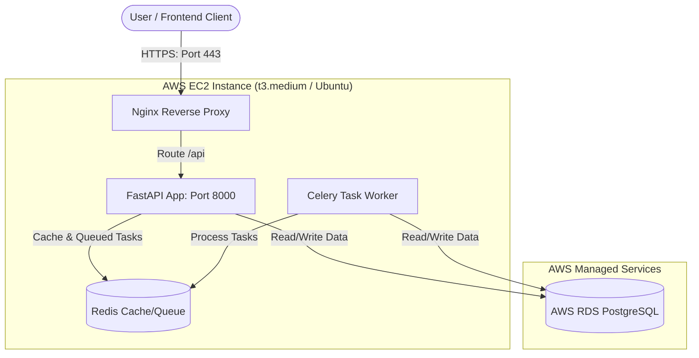

# 🚀 AWS Backend Deployment Guide — Saadhyam AI

This guide provides a comprehensive, step-by-step strategy for deploying the **Saadhyam FastAPI Backend** on Amazon Web Services (AWS). Since this is your first AWS deployment, we will focus on the most reliable, cost-effective, and easiest-to-manage architecture: **AWS EC2 with Docker Compose** (for application execution, Celery workers, and Redis) paired with **AWS RDS PostgreSQL** (for a fully managed database).

---

## 🏗️ Deployment Architecture

The recommended architecture runs the FastAPI server, Redis, and Celery task workers on a single AWS EC2 instance using Docker Compose to save costs, while keeping the database highly secure and managed inside AWS RDS.



---

## 💰 Expected Monthly Cost (Estimation)
AWS offers a **12-Month Free Tier** for new accounts, which covers this entire setup:
1. **EC2 Instance (t3.micro or t2.micro):** **100% FREE TIER** (750 hours/month free). We will configure a **Swap File** (virtual memory) to allow running FastAPI, Celery, and Redis together on this free instance.
2. **RDS PostgreSQL (db.t3.micro):** **100% FREE TIER** (750 hours/month free and 20GB storage).
3. **Data Transfer & SSL Certificate:** **100% FREE** via Let's Encrypt.
*Total Estimated Cost: $0.00 / month!*

---

## 🛠️ Step 1: Set Up AWS RDS (PostgreSQL Database)

We will use a managed database service (RDS) instead of running PostgreSQL inside EC2. This ensures automated backups, security patches, and database stability.

1. **Log in** to your AWS Console and search for **RDS**.
2. Click **Create database** and choose the following configurations:
   * **Choose a database creation method:** Standard create
   * **Engine options:** PostgreSQL
   * **Engine Version:** PostgreSQL 15 or 16
   * **Templates:** Free Tier (Very Important!)
   * **Settings:**
     * **DB instance identifier:** `saadhyam-prod-db`
     * **Master username:** `saadhyam_admin`
     * **Master password:** *Choose a strong password (write this down!)*
   * **Instance configuration:** `db.t3.micro` (or `db.t4g.micro`)
   * **Storage:** 20 GB General Purpose SSD (gp3)
   * **Connectivity:**
     * **Virtual private cloud (VPC):** Default VPC
     * **Public access:** No *(For security, only the EC2 server will access it)*
     * **VPC security group:** Create new -> Name it `rds-sg`
3. Click **Create Database**.
4. Once created, click on `saadhyam-prod-db` and copy the **Endpoint** (looks like `saadhyam-prod-db.xxxx.us-east-1.rds.amazonaws.com`) and **Port** (`5432`).

---

## 🛠️ Step 2: Launch an AWS EC2 Instance (Virtual Server)

1. Search for **EC2** in the AWS Console and click **Launch instance**.
2. Configure the instance details:
   * **Name:** `saadhyam-backend-prod`
   * **Application and OS Image (AMI):** Ubuntu Server 22.04 LTS (HVM), SSD Volume Type
   * **Instance type:** `t3.micro` (Select `t3.micro` or `t2.micro` - both are marked as **Free tier eligible**).
   * **Key pair (login):** Click **Create new key pair**.
     * **Key pair name:** `saadhyam-key`
     * **Key pair type:** RSA
     * **Private key file format:** `.pem`
     * Download the file and keep it safe! (e.g., in `C:\Users\Sai kiran\.ssh\saadhyam-key.pem`).
3. **Network settings (Security Group):**
   * Select **Create security group**.
   * Add the following **Inbound Security Group Rules**:
     1. **SSH (Port 22):** Source = *My IP* (for secure terminal connection).
     2. **HTTP (Port 80):** Source = *Anywhere-IPv4 (0.0.0.0/0)*.
     3. **HTTPS (Port 443):** Source = *Anywhere-IPv4 (0.0.0.0/0)*.
4. **Configure storage:** Change size to **30 GB** gp3 (30 GB is the maximum storage allowed under AWS Free Tier).
5. Click **Launch instance**.

---

## 🛠️ Step 3: Configure Database Security Group

Currently, your EC2 instance cannot talk to your RDS database because the database security group blocks all incoming traffic.

1. Go to **RDS Console** -> Databases -> Click `saadhyam-prod-db`.
2. Under **Connectivity & security**, click the security group link under **VPC security groups** (`rds-sg`).
3. Select the security group, click **Edit inbound rules**, and add a rule:
   * **Type:** PostgreSQL (5432)
   * **Source:** Custom -> Select the Security Group of your EC2 instance (search for `saadhyam-backend-prod` security group name).
4. Save the rules. Now, only your EC2 instance can talk to your database.

---

## 🛠️ Step 4: SSH Connection & Server Configuration

Open PowerShell on your local Windows machine and connect to your EC2 instance:

```powershell
# 1. Navigate to the directory containing your downloaded .pem key
cd "C:\Users\Sai kiran\.ssh"

# 2. Fix key permissions (Windows equivalent of chmod 400)
icacls .\saadhyam-key.pem /inheritance:r
icacls .\saadhyam-key.pem /grant:r "%username%:R"

# 3. SSH into the EC2 instance (replace <EC2_PUBLIC_IP> with your instance's Public IPv4 address)
ssh -i .\saadhyam-key.pem ubuntu@<EC2_PUBLIC_IP>
```

Once inside the Ubuntu terminal, run the following to install Git, Docker, and Docker Compose:

```bash
# Update packages
sudo apt update && sudo apt upgrade -y

# Install Docker
sudo apt install docker.io -y
sudo systemctl start docker
sudo systemctl enable docker
sudo usermod -aG docker ubuntu

# Install Docker Compose
sudo curl -L "https://github.com/docker/compose/releases/latest/download/docker-compose-$(uname -s)-$(uname -m)" -o /usr/local/bin/docker-compose
sudo chmod +x /usr/local/bin/docker-compose

# Log out and log back in to apply Docker user groups
exit
```
*Log back in using SSH.*

---

## 🛠️ Step 4.5: Configure Swap Space (Crucial for Free Tier)
Since `t3.micro`/`t2.micro` instances only have 1GB of physical RAM, running FastAPI, Celery, and Redis simultaneously will exceed this limit and cause the server to crash (Out of Memory). To prevent this, we set up **2GB of virtual RAM (Swap Space)** on the free 30GB SSD storage.

Run the following commands inside your EC2 terminal:
```bash
# 1. Allocate a 2GB file for swap
sudo fallocate -l 2G /swapfile

# 2. Set secure permissions (only root can read/write)
sudo chmod 600 /swapfile

# 3. Designate the file as swap space
sudo mkswap /swapfile

# 4. Activate the swap space
sudo swapon /swapfile

# 5. Make it permanent so it survives server reboots
echo '/swapfile none swap sw 0 0' | sudo tee -a /etc/fstab

# 6. Verify that it is working (you should see 2.0Gi of swap)
free -h
```

---

## 🛠️ Step 5: Deploying the Application Code

Clone your repository and configure your environment variables:

```bash
# Clone the repository
git clone https://github.com/mentneo175-ops/saadhyam.git
cd saadhyam/Backend

# Create production environment file
cp .env.example .env
nano .env
```

### Configure the `.env` file with production values:
```env
# Database Settings (Replace with your RDS endpoint and password)
DATABASE_URL=postgresql+asyncpg://saadhyam_admin:<YOUR_RDS_PASSWORD>@<YOUR_RDS_ENDPOINT>:5432/postgres

# Redis Settings (Runs inside Docker on localhost)
REDIS_URL=redis://localhost:6379/0

# Production JWT Secret Key (Generate a random 32-character string)
SECRET_KEY=supersecretkeyreplaceinproduction123

# Cloudinary Integration (Copy from your active setup)
CLOUDINARY_CLOUD_NAME=...
CLOUDINARY_API_KEY=...
CLOUDINARY_API_SECRET=...

# Gemini API Keys (Copy from your active setup)
GEMINI_API_KEY=...
```
*(Press `Ctrl+O` then `Enter` to save, and `Ctrl+X` to exit nano)*

---

## 🛠️ Step 6: Create the Docker Compose Setup

We will configure `docker-compose.yml` to run:
1. **Web App:** FastAPI application run by Gunicorn/Uvicorn.
2. **Celery Worker:** Handles async voice agents and processing tasks.
3. **Redis:** Acts as queue broker for Celery and cache database.

In the `Backend/` folder, create `docker-compose.prod.yml`:

```bash
nano docker-compose.prod.yml
```

Paste the following configurations:
```yaml
version: '3.8'

services:
  redis:
    image: redis:7-alpine
    container_name: saadhyam_redis
    ports:
      - "6379:6379"
    restart: always
    volumes:
      - redis_data:/data

  web:
    build: .
    container_name: saadhyam_web
    command: uvicorn main:app --host 0.0.0.0 --port 8000 --workers 4
    ports:
      - "8000:8000"
    volumes:
      - .:/app
    environment:
      - DATABASE_URL=postgresql+asyncpg://saadhyam_admin:<YOUR_RDS_PASSWORD>@<YOUR_RDS_ENDPOINT>:5432/postgres
      - REDIS_URL=redis://redis:6379/0
    depends_on:
      - redis
    restart: always

  celery_worker:
    build: .
    container_name: saadhyam_celery
    command: celery -A celery_app worker --loglevel=info
    volumes:
      - .:/app
    environment:
      - DATABASE_URL=postgresql+asyncpg://saadhyam_admin:<YOUR_RDS_PASSWORD>@<YOUR_RDS_ENDPOINT>:5432/postgres
      - REDIS_URL=redis://redis:6379/0
    depends_on:
      - redis
    restart: always

volumes:
  redis_data:
```

### Start the Services
Run Docker Compose in detached mode:
```bash
docker-compose -f docker-compose.prod.yml up -d --build
```

---

## 🛠️ Step 7: Configure Nginx & SSL (Certbot)

To access your backend securely via `https://api.yourdomain.com`, set up Nginx as a reverse proxy:

```bash
# Install Nginx
sudo apt install nginx -y

# Configure Nginx for Saadhyam
sudo nano /etc/nginx/sites-available/saadhyam
```

Paste the following config (replace `api.yourdomain.com` with your actual subdomain pointing to the EC2 Public IP):
```nginx
server {
    listen 80;
    server_name api.yourdomain.com;

    location / {
        proxy_pass http://localhost:8000;
        proxy_set_header Host $host;
        proxy_set_header X-Real-IP $remote_addr;
        proxy_set_header X-Forwarded-For $proxy_add_x_forwarded_for;
        proxy_set_header X-Forwarded-Proto $scheme;
    }
}
```

Enable the configuration and restart Nginx:
```bash
sudo ln -s /etc/nginx/sites-available/saadhyam /etc/nginx/sites-enabled/
sudo rm /etc/nginx/sites-enabled/default
sudo nginx -t
sudo systemctl restart nginx
```

### Install SSL Certificate (Let's Encrypt)
```bash
sudo apt install certbot python3-certbot-nginx -y
sudo certbot --nginx -d api.yourdomain.com
```
Follow the prompts, and Certbot will automatically provision your SSL certificate and update Nginx to route HTTPS traffic safely.

---

## 🔄 Running Database Migrations
When deploying for the first time (or when changes occur), run database migrations using the Python interpreter inside the container:
```bash
docker-compose -f docker-compose.prod.yml exec web python -m migrations.add_performance_indexes
```

---

## 🚀 CI/CD Automation (GitHub Actions)
To deploy automatically on every `git push origin main`, add this GitHub Actions workflow at `.github/workflows/deploy.yml`:

```yaml
name: Deploy Backend to AWS EC2

on:
  push:
    branches:
      - main

jobs:
  deploy:
    runs-on: ubuntu-latest
    steps:
      - name: Deploy via SSH
        uses: appleboy/ssh-action@master
        with:
          host: ${{ secrets.EC2_HOST }}
          username: ubuntu
          key: ${{ secrets.EC2_SSH_KEY }}
          script: |
            cd saadhyam/Backend
            git pull origin main
            docker-compose -f docker-compose.prod.yml up -d --build
```
*Add `EC2_HOST` (IP) and `EC2_SSH_KEY` (Content of your `saadhyam-key.pem`) to your GitHub repository Secrets.*
