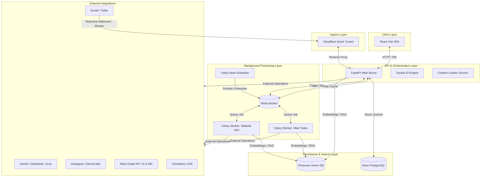

# 🪐 Saadhyam AI: Enterprise Marketing & Intelligence Suite

Saadhyam AI is a premium, state-of-the-art marketing, communication, and intelligence suite designed to empower businesses with automated growth, digital presence, and real-time operations. It integrates advanced generative AI models, automated social media scheduling, programmatic voice telephony, WhatsApp marketing, and dynamic website creation into a single unified platform.

---

## 🏗️ System Architecture

Saadhyam AI uses a distributed, micro-service-oriented architecture backed by an asynchronous processing pipeline and real-time event distribution.



### 📡 Data Flow & Key Integration Mechanics

1. **Cloudflare Tunnel Gateway**: Since the platform relies on external webhooks (e.g., Meta WhatsApp events, Exotel telephony media streams), the local FastAPI instance is exposed securely via Cloudflare Quick Tunnels. When `start_tunnel.py` runs, it establishes a secure tunnel and updates `EXOTEL_STREAM_URL` in the `.env` dynamically, enabling external webhooks to stream voice data directly to the local dev environment.
2. **Real-time Telephony Pipeline**:
   - Voice agent receives or initiates calls through Twilio/Exotel.
   - Live audio streaming utilizes raw WebSockets (`streaming_handler.py`).
   - Transcription is handled by **Deepgram** (Speech-to-Text).
   - Conversational responses are generated using **Gemini** or **Groq** (LLM).
   - Audio is generated using **ElevenLabs** (Text-to-Speech) and played back with sub-second latency.
3. **Background Worker Topology**: Long-running generation jobs, email campaigns, and scheduled social media posts are offloaded to **Celery Workers** through **Redis**.
   - **Main Celery Worker**: Processes Instagram posts, Meta Ad operations, and WhatsApp campaigns.
   - **Website AI Worker**: Handles heavy HTML/CSS templating and layout generation for the website creation module.
   - **Celery Beat**: Polls database tables to process scheduled campaigns and handles token refreshes.

---

## 🛠️ Technology Stack

Saadhyam AI utilizes a high-performance modern tech stack across all layers of the application:

| Layer | Technology | Purpose |
| :--- | :--- | :--- |
| **Frontend** | React 18, TypeScript, Vite | User Interface, fast compilation, and rendering. |
| | TanStack Router | Type-safe routing and navigation. |
| | TanStack Query (React Query) | Server state management and caching. |
| | TailwindCSS (v4) | Design system, styling, and glassmorphic UI. |
| | Framer Motion | Premium, smooth micro-animations. |
| | Radix UI (Shadcn-style) | Highly accessible UI primitives. |
| | Recharts & Leaflet | Analytics visualization and geospatial business mapping. |
| **Backend** | FastAPI (Python) | High-performance, asynchronous REST API. |
| | SQLAlchemy & asyncpg | Fully async ORM layer targeting PostgreSQL. |
| | Python-SocketIO | High-concurrency real-time WebSocket connection engine. |
| | Celery | Asynchronous task queue and worker execution pool. |
| | Redis | High-speed cache and Celery task broker. |
| **AI/ML** | Google Gemini (2.5 Flash/Pro) | AI Auditing, RAG, Google Search grounded business analysis. |
| | Groq (Llama-3.1-8b) | Low-latency inference for conversational agents and voice calls. |
| | TinyLlama (Local) | Local fallback model server for review replies. |
| | Hugging Face (FLUX) | High-fidelity image and marketing graphic generation. |
| **External API**| Meta Graph API | Instagram posting, accounts sync, Meta Ads orchestration. |
| | WhatsApp Cloud API | Automated WhatsApp marketing, flows, and campaign analytics. |
| | Exotel & Twilio | Programmatic telephony, outbound queues, and media streaming. |
| | Cloudinary | Cloud storage and CDN optimization for marketing collateral. |

---

## 📂 Codebase Structure

The workspace is organized into a clean mono-repo structure representing separation of concerns between client interface and backend execution:

```
Sadhyam/
│
├── Backend/                       # FastAPI Server & AI Services
│   ├── ai_models/                 # Model servers and prompt engines
│   │   ├── business_analysis/     # RAG engines and Gemini groundings
│   │   ├── content_creator/       # Graphic copywriting and design prompts
│   │   └── website_ai/            # Website generator components and static assets
│   │
│   ├── config/                    # Global Configurations
│   │   ├── database.py            # Async Database Engine (asyncpg)
│   │   └── settings.py            # Pydantic Settings & Environment Variables
│   │
│   ├── db/                        # Database schemas and connections
│   ├── middleware/                # Security (Rate Limiting, Audit logs, HTTPS)
│   ├── migrations/                # Database migrations for Neon PostgreSQL
│   ├── models/                    # SQLAlchemy Model Definitions
│   ├── routes/                    # API Endpoints (FastAPI Routers)
│   ├── schemas/                   # Pydantic request/response schemas
│   ├── services/                  # Business Logic, Integrations & Third-Party APIs
│   │   ├── voice_agent_service.py # Telephony, TTS/STT, and Streaming Call Logic
│   │   ├── whatsapp_service.py    # Meta WhatsApp template and campaign engine
│   │   └── gemini_business_analysis_service.py # Gemini-powered business RAG
│   │
│   ├── tasks/                     # Celery background tasks
│   ├── main.py                    # Server entry point & Socket.IO mounting
│   ├── celery_app.py              # Celery configuration
│   └── celery_worker.py           # Main background worker daemon
│
├── Frontend/                      # React SPA (Vite)
│   ├── src/
│   │   ├── components/            # UI components (dashboard, whatsapp, etc.)
│   │   ├── routes/                # TanStack Router page templates
│   │   ├── contexts/              # Global state providers (Auth, Socket)
│   │   ├── hooks/                 # Custom React hooks
│   │   └── styles/                # CSS themes & Tailwind configs
│   ├── tsconfig.json              # TypeScript configuration
│   └── vite.config.ts             # Vite server configurations
│
├── start_all.bat                  # Windows startup orchestrator
├── start_all.sh                   # UNIX startup orchestrator
└── stop_all.bat                   # Windows service teardown script
```

---

## ⚙️ Setup & Installation

### 1. Prerequisites
Ensure the following are installed and configured on your host system:
- **Python 3.8+** (Virtual environment required)
- **Node.js 18+** (with npm or Bun package manager)
- **Redis Server** (listening on default port `6379`)
- **PostgreSQL Database** (Ideally Neon DB for serverless scaling)

### 2. Environment Configuration
Create a `.env` file inside the `Backend/` directory. Use [Backend/.env.example](file:///c:/Users/Sai%20kiran/Desktop/Sadhyam/Backend/.env.example) as a baseline. Configure the following critical variables:

```env
# Database & Cache
DATABASE_URL=postgresql+asyncpg://<user>:<password>@<host>/<database>?ssl=require
REDIS_URL=redis://localhost:6379/0

# Authentication
SECRET_KEY=your-jwt-signing-secret

# LLM Providers
GEMINI_API_KEY=your-google-ai-studio-gemini-key
GROQ_API_KEY=your-groq-inference-api-key

# Media CDN
CLOUDINARY_CLOUD_NAME=your-cloudinary-name
CLOUDINARY_API_KEY=your-cloudinary-api-key
CLOUDINARY_API_SECRET=your-cloudinary-api-secret

# Voice Agent (Optional - Telephony credentials)
DEEPGRAM_API_KEY=your-deepgram-api-key
ELEVENLABS_API_KEY=your-elevenlabs-api-key
EXOTEL_SID=your-exotel-sid
EXOTEL_API_KEY=your-exotel-api-key
EXOTEL_API_TOKEN=your-exotel-token
EXOPHONE_NUMBER=your-exotel-phone-number
```

Ensure a matching `.env` is initialized in the `Frontend/` folder following [Frontend/.env.example](file:///c:/Users/Sai%20kiran/Desktop/Sadhyam/Frontend/.env.example) to point the client application to your local backend API.

---

## 🚀 Running Saadhyam AI

The workspace includes convenient orchestrator scripts to boot all 7 service processes concurrently.

### On Windows
Simply run the startup batch file from the root directory:
```cmd
start_all.bat
```
This script will verify your Python/Node runtime environment, confirm Redis availability, launch the Cloudflare Tunnel, spin up the backend server, boot the Celery worker nodes & Beat scheduler, run the image generator micro-server, and start the Vite frontend dev server.

### On macOS / Linux
Open a terminal in the root directory and execute:
```bash
chmod +x start_all.sh
./start_all.sh
```

### Stopping Services
To cleanly terminate all running services, close the terminal windows spawned by the startup script, or run:
```cmd
stop_all.bat
```

---

## 📊 Maintenance & Diagnostic Scripts

The root folder contains helper scripts designed to assist during troubleshooting:

* **[start_tunnel.bat](file:///c:/Users/Sai%20kiran/Desktop/Sadhyam/start_tunnel.bat)** / **[start_tunnel.py](file:///c:/Users/Sai%20kiran/Desktop/Sadhyam/Backend/start_tunnel.py)**: Independently boots the Cloudflare tunnel and updates the active Exotel webhook forwarding address inside `.env`.
* **[force_data_retrieval.py](file:///c:/Users/Sai%20kiran/Desktop/Sadhyam/force_data_retrieval.py)**: Bypasses pending dashboard status checks to fetch existing business intelligence records directly from the database in the event of an API error.
* **[restore_data.py](file:///c:/Users/Sai%20kiran/Desktop/Sadhyam/restore_data.py)**: Clears cache instances, handles rate limit exceptions caused by Gemini API free tier limits, and manually queues a fresh RAG-grounded business analysis run.

---

## 🔒 Security System (Phase 1 & 2)

Saadhyam AI implements a layered security model:
1. **Dynamic Rate Limiting**: Managed by `middleware/security.py`, preventing brute force attacks and resource starvation.
2. **Audit Logging**: Captures key administrator actions and logs structural changes to the environment in `logs/audit.log`.
3. **Password Policies**: Enforces strict composition, password expiry, and tracks historical hashes.
4. **API Key Management**: Offers cryptographically secure token generation and rotation for programmatic backend queries.
5. **Secure Middleware**: Enforces SSL redirection, limits max request payload sizes, and injects hardened HTTP headers (CSP, HSTS, X-Content-Type-Options).
