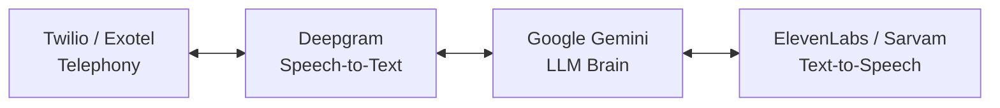

# AI Voice Agent Cost Planning & Budget Report

This report outlines the operational cost structure for the Saadhyam AI Outbound Voice Agent feature. It includes a line-item pricing breakdown of the telephony, Speech-to-Text (STT), LLM brain, and Text-to-Speech (TTS) services integrated into the backend, followed by cost-per-call estimates and monthly scaling scenarios.

---

## 🧩 1. System Architecture Components

The outbound telecalling system relies on 4 real-time API integrations for each call:

1. **Telephony & Connection:** Twilio or Exotel (dials numbers, leases lines, establishes media streaming).
2. **Speech-to-Text (STT):** Deepgram Nova-2 (transcribes customer audio streams to text in real-time).
3. **LLM Brain:** Google Gemini 2.5 Flash (understands transcript context and generates natural dialogue turns).
4. **Text-to-Speech (TTS):** ElevenLabs (English fallback) or Sarvam AI (high-quality Telugu/Hindi voices).

---

## 💰 2. Line-Item Service Pricing (2026 Rates)

### A. Telephony (Twilio)
* **Phone Number Rental:** ~$1.15/month per local US number (or ~$3.00/month for Indian local numbers).
* **Call Rates:**
  * Outbound calls to US numbers: **$0.014 / minute**
  * Outbound calls to India numbers: **$0.024 / minute**
* *Billing basis:* Per second (rounded up to nearest minute).

### B. Real-Time Speech-to-Text (Deepgram)
* **Model:** Nova-2 Phone Call (high-accuracy real-time model).
* **Cost:** **$0.0043 / minute** (or ~$0.26 per hour).
* *Bonus:* Deepgram provides **$200 in free credits** upon registration (approx. 46,000 free minutes).

### C. LLM Brain (Google Gemini 2.5 Flash)
* **Input Tokens:** $0.075 / 1 Million tokens.
* **Output Tokens:** $0.300 / 1 Million tokens.
* *Average consumption per call:* ~4,000 input tokens, ~1,500 output tokens.
* **Cost:** **~$0.00075 / call** (essentially negligible/free).

### D. Text-to-Speech (ElevenLabs vs Sarvam AI)

TTS is the most significant cost driver. We have configured both providers in the backend:

| Metric | ElevenLabs (Paid Plans) | Sarvam AI (Telugu/Hindi) |
| :--- | :--- | :--- |
| **Model** | Multilingual v2 / Flash | Bulbul v3 |
| **Standard Rate** | **$0.18 per 1,000 characters** | **₹1.00 (~$0.012) per 1,000 characters** |
| **Free Tier** | 10,000 characters/month | None |

> [!NOTE]
> **Sarvam AI** is **15x cheaper** than ElevenLabs for Indian languages (Telugu/Hindi) and delivers much higher accent accuracy.

---

## 📊 3. Cost-per-Call Breakdown

Let's estimate the cost of an average **2.5-minute call** consisting of:
* 2.5 minutes of call duration (Twilio + Deepgram).
* 8 dialogue turns (AI generates ~300 words total / ~1,800 characters).

### Scenario A: English Call (using ElevenLabs TTS)
* **Twilio Minutes:** $0.014 × 2.5 min = **$0.035**
* **Deepgram STT:** $0.0043 × 2.5 min = **$0.011**
* **Gemini LLM:** Negligible = **$0.001**
* **ElevenLabs TTS:** $0.18 × 1.8 (1,800 chars) = **$0.324**
* **Total Estimated Cost per Call:** **$0.371 (~₹31.00)**

### Scenario B: Telugu/Hindi Call (using Sarvam AI TTS)
* **Twilio Minutes:** $0.024 × 2.5 min = **$0.060**
* **Deepgram STT:** $0.0043 × 2.5 min = **$0.011**
* **Gemini LLM:** Negligible = **$0.001**
* **Sarvam AI TTS:** $0.012 × 1.8 (1,800 chars) = **$0.022**
* **Total Estimated Cost per Call:** **$0.094 (~₹7.80)**

---

## 📈 4. Monthly Scaling Scenarios

Here is how the cost scales depending on call volume and target language:

### Tier 1: Starter (100 Calls / Month)
* **English Only (ElevenLabs):** **$37.10 / month**
* **Indian Languages (Sarvam):** **$9.40 / month**
* *Best for:* Small testing, product onboarding validations.

### Tier 2: Growth (1,000 Calls / Month)
* **English Only (ElevenLabs):** **$371.00 / month**
* **Indian Languages (Sarvam):** **$94.00 / month**
* *Best for:* Active lead follow-up campaigns, customer feedback surveys.

### Tier 3: Scale (10,000 Calls / Month)
* **English Only (ElevenLabs):** **$3,710.00 / month**
* **Indian Languages (Sarvam):** **$940.00 / month**
* *Best for:* Full-scale business process automation.

---

## 💡 5. Cost-Optimization Best Practices

To keep your telecalling budgets highly efficient, apply the following optimizations in your settings:

1. **Be Concise in System Prompts:** Instruct the Gemini agent inside `Configure Agents` to output replies under **25 words** per turn. Cutting character counts in half directly saves 50% of ElevenLabs/Sarvam costs.
2. **Prioritize Sarvam AI for Multilingual Outbound:** Ensure your default provider is set to `sarvam` in your configuration (`TTS_PROVIDER=sarvam`) for Indian regions.
3. **Handle Voicemail/Busy Signals Promptly:** Implement webhook event handlers that detect Twilio call outcomes (busy, no-answer) immediately, ensuring you don't pay carrier connection fees or trigger TTS synthesis for calls that aren't picked up.
